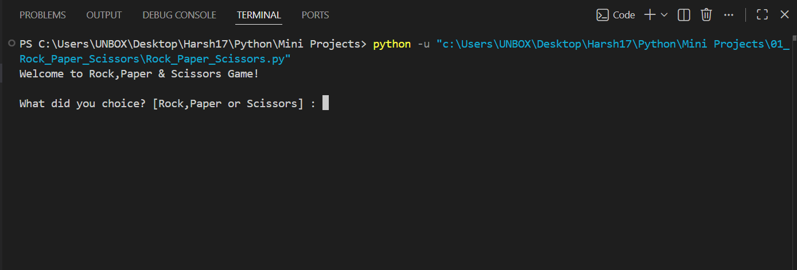
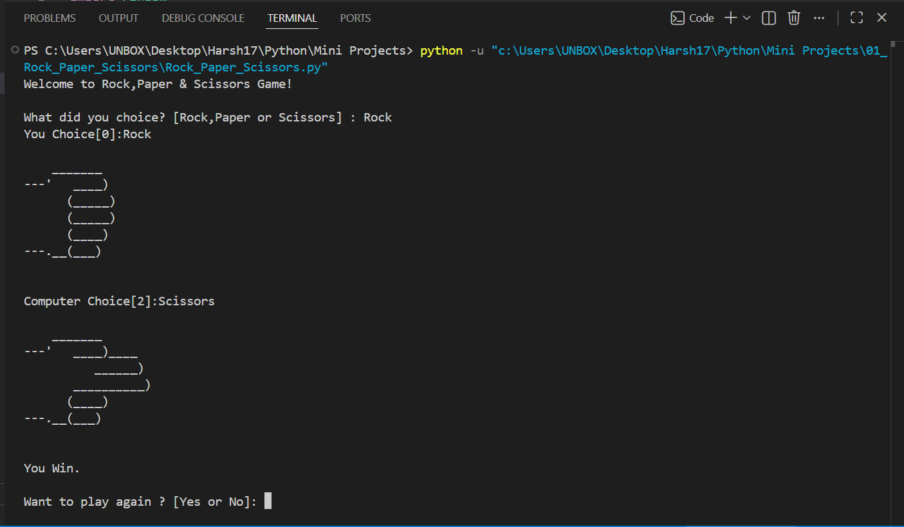

# 🎮 Rock Paper Scissors Game

A simple **console-based Rock, Paper, Scissors game** built with Python. The player competes against the computer, which randomly selects its move. The game displays ASCII art for each choice, determines the winner based on the classic game rules, and allows the player to play multiple rounds.

   

---

## 📖 Project Overview

This project was developed to practice Python fundamentals such as functions, conditional statements, modules, user input handling, and random number generation.

The game imports ASCII artwork from a separate Python module, making the code more organized and easier to maintain.

---

## ✨ Features

- 🎮 Interactive console gameplay
- 🤖 Random computer move generation
- ✋ ASCII art for Rock, Paper, and Scissors
- 🧩 Modular code using multiple Python files
- 🔄 Play Again functionality
- ✅ Input validation for player choices
- 🏆 Automatic winner determination

---

## 🎯 Gameplay

1. Run the program.
2. Enter one of the following choices:

   - Rock
   - Paper
   - Scissors
3. The computer randomly selects its move.
4. Both choices are displayed using ASCII art.
5. The game announces the winner.
6. Choose whether to play another round.

---

## 📂 Project Structure

```text
01_Rock_Paper_Scissors/
│
├── README.md
├── Rock_Paper_Scissors.py      # Main game logic
├── rock_art.py                 # ASCII artwork
└── Screenshot/
    ├── 1.png
    └── 2.png
```

---

## 🛠️ Technologies Used

- Python 3
- Random Module
- Python Functions
- Python Modules
- Console Input/Output

---

## 🚀 Getting Started

### Clone the repository

```bash
git clone https://github.com/Harsh-Belekar/Python-Projects.git
```

### Navigate to the project folder

```bash
cd Python-Projects/01_Rock_Paper_Scissors
```

### Run the program

```bash
python Rock_Paper_Scissors.py
```

---

## 📸 Screenshots

### Game Start



### Gameplay



---

## 🧠 Python Concepts Practiced

- Variables
- Functions
- Conditional Statements (`if`, `elif`, `else`)
- User Input (`input()`)
- Random Number Generation (`random`)
- Python Modules (`import`)
- Code Modularization
- String Manipulation
- Console-Based User Interface

---

## 📚 Files Description

### `Rock_Paper_Scissors.py`

Contains the main game logic, including:

- User input
- Computer move generation
- Winner calculation
- Replay functionality
- Game flow

### `rock_art.py`

Contains the ASCII art used to display:

- 🪨 Rock
- 📄 Paper
- ✂️ Scissors

Separating the artwork from the game logic improves readability and maintainability.

---

## 🔮 Future Improvements

Possible enhancements for future versions:

- 🎨 Graphical User Interface (Tkinter or Pygame)
- 📊 Scoreboard
- 🔊 Sound Effects
- 🎯 Difficulty Levels
- 👥 Two-Player Mode
- 🧠 Smarter Computer AI
- 📈 Game Statistics
- 🎞️ Animated ASCII Effects

---

## 🎯 Learning Outcome

Through this project, I learned how to:

- Organize Python code into multiple modules
- Build interactive console applications
- Generate random computer decisions
- Implement game logic using conditional statements
- Improve code readability using functions
- Create reusable and maintainable Python programs

---

## 📂 More Projects

Explore the complete **Python Projects Portfolio** to see more Python games, automation tools, GUI applications, and API-based projects.

***⭐ If you like this project, don't forget to star the repository!***
