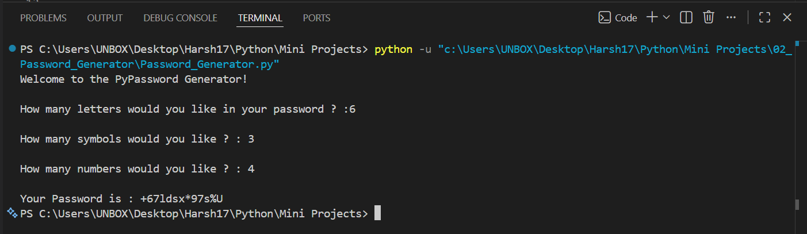

# 🔐 Password Generator

A simple **console-based Password Generator** built with Python that creates strong and randomized passwords based on the user's preferences. The user specifies the number of letters, symbols, and numbers to include, and the program generates a shuffled password containing all requested characters.

   

---

## 📖 Project Overview

This project was developed to practice Python fundamentals such as lists, functions, loops, randomization, user input handling, and string manipulation.

The password is generated by randomly selecting characters from predefined lists of letters, numbers, and symbols before shuffling them to create a secure and unpredictable password.

---

## ✨ Features

- 🔐 Generates strong random passwords
- 🔤 User-defined number of letters
- 🔢 User-defined number of numbers
- 🔣 User-defined number of symbols
- 🎲 Random character selection
- 🔀 Password shuffling for improved randomness
- ⚡ Simple and interactive console interface

---

## ⚙️ How It Works

1. Run the program.
2. Enter the number of:

   - Letters
   - Symbols
   - Numbers
3. The program randomly selects the requested characters.
4. All selected characters are shuffled.
5. A random password is displayed.

---

## 📂 Project Structure

```text
02_Password_Generator/
│
├── README.md
├── Password_Generator.py
└── Screenshot/
    └── 1.png
```

---

## 🛠️ Technologies Used

- Python 3
- Random Module
- Lists
- Functions
- Loops
- Console Input/Output

---

## 🚀 Getting Started

### Clone the repository

```bash
git clone https://github.com/Harsh-Belekar/Python-Projects.git
```

### Navigate to the project folder

```bash
cd Python-Projects/02_Password_Generator
```

### Run the program

```bash
python Password_Generator.py
```

---

## 📸 Screenshot

### Password Generation



---

## 🧠 Python Concepts Practiced

- Variables
- Lists
- Functions
- Loops
- User Input (`input()`)
- Random Module (`random.choice()`)
- List Shuffling (`random.shuffle()`)
- String Concatenation
- List Manipulation

---

## 📚 File Description

### `Password_Generator.py`

The main Python program that:

- Collects password requirements from the user
- Randomly selects letters, numbers, and symbols
- Stores selected characters in a list
- Shuffles the password for better randomness
- Combines all characters into the final password
- Displays the generated password

---

## 🔮 Future Improvements

Possible enhancements for future versions:

- 🔢 Password length option instead of separate inputs
- 👁️ Password strength indicator
- 📋 Copy password directly to clipboard
- 💾 Save generated passwords to a file
- 🎨 Graphical User Interface (Tkinter)
- 🔐 Option to exclude ambiguous characters (e.g., `0`, `O`, `l`, `1`)
- ⚙️ Custom symbol selection
- 📈 Generate multiple passwords at once

---

## 🎯 Learning Outcomes

Through this project, I learned how to:

- Generate random data using Python
- Work with lists and list operations
- Build reusable functions
- Shuffle data for improved randomness
- Collect and process user input
- Manipulate strings dynamically
- Organize code into logical sections

---

## 📂 More Projects

This project is part of my **Python Projects Portfolio**, a collection of Python projects covering:

- 🎮 Games
- 🖥️ GUI Applications
- 🤖 Automation
- 🌐 API Integrations
- 📊 Data Processing
- 🧩 Python Fundamentals

*Explore the repository to discover more Python projects and follow my learning journey.*

***⭐ If you like this project, don't forget to star the repository!***
