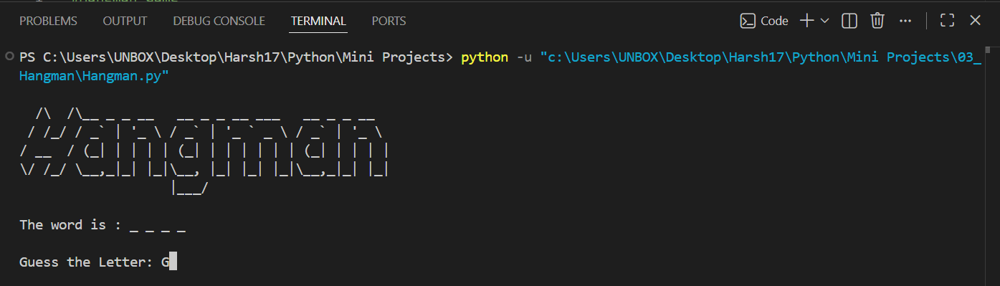
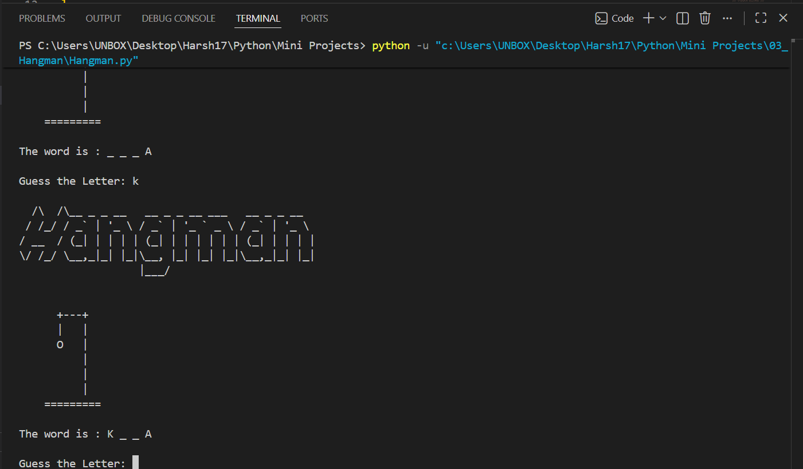
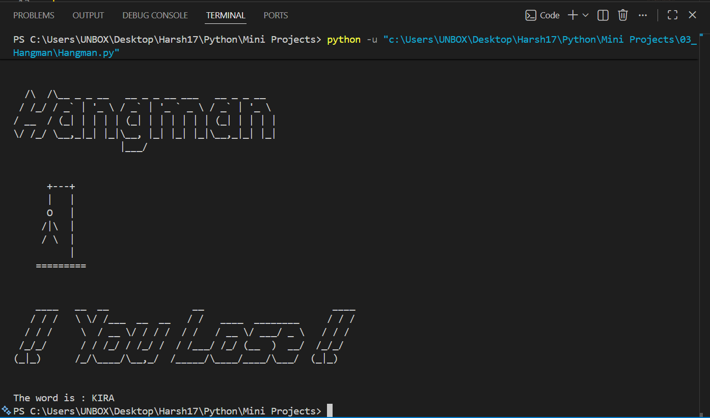
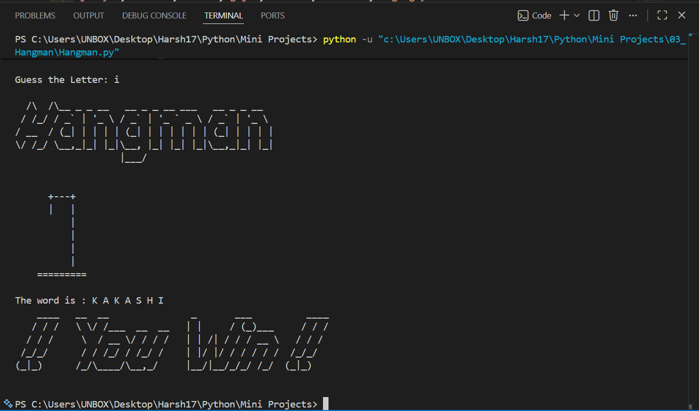

# 🎯 Hangman Game

A classic **console-based Hangman Game** built with Python where players guess letters to reveal a hidden word before running out of lives. The game features ASCII art animations, multiple Hangman stages, anime-themed words, and separate modules for better code organization.

   

---

# 📖 Project Overview

This project was developed to practice Python fundamentals including loops, functions, lists, string manipulation, conditional statements, modular programming, and game logic.

The player must correctly guess all letters of a randomly selected word while avoiding incorrect guesses that gradually build the Hangman.

---

# ✨ Features

- 🎮 Interactive console gameplay
- 🎲 Random word selection
- 🎯 Anime-inspired word collection
- 🎨 ASCII Hangman logo
- 💀 7-stage Hangman animation
- 🏆 Win and Lose screens
- 📝 Letter-by-letter guessing
- ❤️ Life tracking system
- 📦 Modular project structure using multiple Python files

---

# 🎮 Gameplay

1. Run the program.
2. A random word is selected.
3. Hidden letters are displayed as `_`.
4. Enter one letter at a time.
5. Correct guesses reveal the letter.
6. Incorrect guesses reduce your remaining lives.
7. Guess the complete word before all lives are lost.

---

# 📂 Project Structure

```text
03_Hangman/
│
├── README.md
├── Hangman.py
├── hangman_art.py
└── Screenshot/
    ├── 1.png
    ├── 2.png
    ├── 3.png
    └── 4.png
```

---

# 🛠️ Technologies Used

- Python 3
- Random Module
- Lists
- Functions
- Loops
- Conditional Statements
- Console Input/Output

---

# 🚀 Getting Started

### Clone the repository

```bash
git clone https://github.com/Harsh-Belekar/Python-Projects.git
```

### Navigate to the project folder

```bash
cd Python-Projects/03_Hangman
```

### Run the program

```bash
python Hangman.py
```

---

# 📸 Screenshots

## Game Start



---

## Guessing Letters



---

## Game Over



---

## Victory Screen



---

# 🧠 Python Concepts Practiced

- Variables
- Lists
- Functions
- Loops (`while`, `for`)
- Conditional Statements
- String Manipulation
- User Input
- Random Module
- List Indexing
- Modular Programming
- Game State Management

---

# 📚 Files Description

## `Hangman.py`

Contains the complete game logic including:

- Random word generation
- User input
- Letter matching
- Life management
- Win/Lose conditions
- Display updates

---

## `hangman_art.py`

Contains all reusable game assets including:

- Hangman Logo
- Win Banner
- Lose Banner
- Hangman ASCII Stages
- Word List

Separating game assets from the logic makes the project cleaner, more modular, and easier to maintain.

---

# 🎯 Game Rules

- Guess **one letter** at a time.
- Every incorrect guess costs **one life**.
- Correct guesses reveal matching letters.
- Reveal the complete word before the Hangman drawing is completed.
- Lose all lives and the game ends.

---

# 🔮 Future Improvements

Possible enhancements for future versions:

- 🎚️ Easy, Medium & Hard difficulty levels
- 📚 Larger word dictionary
- 💡 Hint system
- ❤️ Visible remaining lives counter
- 📊 Score tracking
- 🎨 GUI version using Tkinter
- 🎮 Pygame version
- 🔊 Sound effects
- 🔄 Play Again option
- 👥 Multiplayer mode

---

# 🎯 Learning Outcomes

Through this project, I learned how to:

- Build a complete game loop
- Manage game states using variables
- Work with lists and strings
- Implement letter matching logic
- Organize projects using multiple Python modules
- Display ASCII animations
- Create reusable code structures
- Build interactive console games

---

# 📂 More Projects

This project is part of my **Python Projects Portfolio**, a collection of Python projects covering:

- 🎮 Games
- 🖥️ GUI Applications
- 🤖 Automation
- 🌐 API Integrations
- 📊 Data Processing
- 🧩 Python Fundamentals

*Explore the repository to discover more projects and follow my Python learning journey.*

***⭐ If you like this project, don't forget to star the repository!***