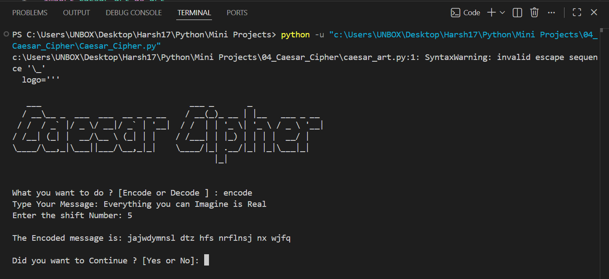
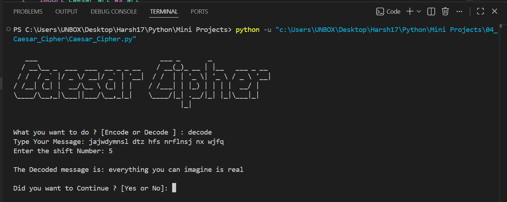

# 🔐 Caesar Cipher

A **console-based Caesar Cipher application** built with Python that allows users to **encode** and **decode** secret messages using the classic Caesar Cipher encryption technique. The program supports customizable shift values, preserves non-alphabetic characters, and allows multiple encryption or decryption operations in a single session.

   

---

# 📖 Project Overview

This project was developed to practice Python fundamentals including string manipulation, functions, loops, conditional statements, modular programming, and basic encryption techniques.

The Caesar Cipher works by shifting each alphabet letter by a specified number of positions. Users can both encrypt plain text and decrypt previously encrypted messages.

---

# ✨ Features

- 🔐 Encode secret messages
- 🔓 Decode encrypted messages
- 🔢 Custom shift value
- 🔄 Supports unlimited shift values using modulo (`% 26`)
- 🔤 Preserves spaces, numbers, and special characters
- ♻️ Multiple encode/decode operations without restarting
- 🎨 Custom ASCII logo
- 📦 Modular project structure

---

# ⚙️ How It Works

### Encoding

1. Select **Encode**
2. Enter your message
3. Enter a shift number
4. The encrypted message is displayed

### Decoding

1. Select **Decode**
2. Enter the encrypted message
3. Enter the same shift number
4. The original message is revealed

---

# 📂 Project Structure

```text
04_Caesar_Cipher/
│
├── README.md
├── Caesar_Cipher.py
├── caesar_art.py
└── Screenshot/
    ├── 1.png
    └── 2.png
```

---

# 🛠️ Technologies Used

- Python 3
- Functions
- Lists
- Loops
- Conditional Statements
- String Manipulation
- Console Input/Output

---

# 🚀 Getting Started

### Clone the repository

```bash
git clone https://github.com/Harsh-Belekar/Python-Projects.git
```

### Navigate to the project folder

```bash
cd Python-Projects/04_Caesar_Cipher
```

### Run the program

```bash
python Caesar_Cipher.py
```

---

# 📸 Screenshots

## Encode Message



---

## Decode Message



---

# 🧠 Python Concepts Practiced

- Variables
- Lists
- Functions
- Loops
- Conditional Statements
- String Manipulation
- List Indexing
- User Input
- Modular Programming
- Basic Cryptography Logic

---

# 📚 Files Description

## `Caesar_Cipher.py`

Contains the main application logic including:

- User input handling
- Encode and Decode functionality
- Character shifting
- Shift normalization using modulo
- Multiple operation loop

---

## `caesar_art.py`

Contains the ASCII logo displayed when the application starts.

Keeping the artwork separate from the program logic improves readability and project organization.

---

# 🔐 Caesar Cipher Algorithm

The program encrypts text by shifting each alphabet letter forward by the specified shift value.

Example:

```text
Original : hello
Shift    : 3
Encoded  : khoor
```

To decode, the program shifts each letter backward using the same shift value.

---

# 🔮 Future Improvements

Possible enhancements for future versions:

- 🔤 Preserve uppercase letters
- 🔑 Random key generation
- 📂 Encrypt and decrypt text files
- 🖥️ GUI version using Tkinter
- 🌐 Web version using Flask
- 🔒 Multiple encryption algorithms
- 📋 Copy encrypted text to clipboard
- 📜 Encryption history

---

# 🎯 Learning Outcomes

Through this project, I learned how to:

- Implement a classic encryption algorithm
- Work with strings and character indexing
- Build reusable Python functions
- Normalize values using the modulo operator
- Handle user input effectively
- Organize code into multiple modules
- Develop interactive console applications

---

# 📂 More Projects

This project is part of my **Python Projects Portfolio**, a collection of Python projects covering:

- 🎮 Games
- 🖥️ GUI Applications
- 🤖 Automation
- 🌐 API Integrations
- 📊 Data Processing
- 🧩 Python Fundamentals

*Explore the repository to discover more projects and follow my Python learning journey.*

***⭐ If you like this project, don't forget to star the repository!***