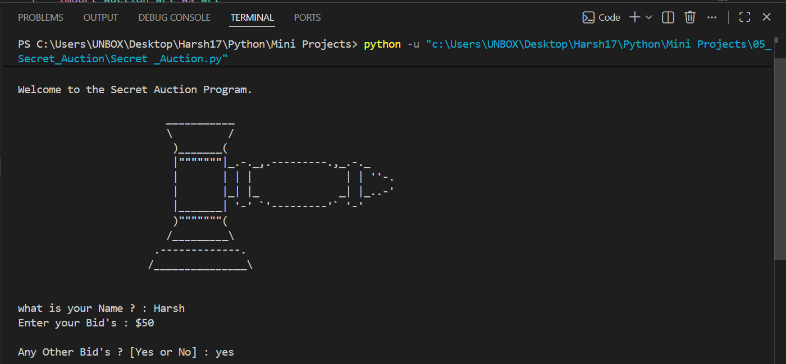
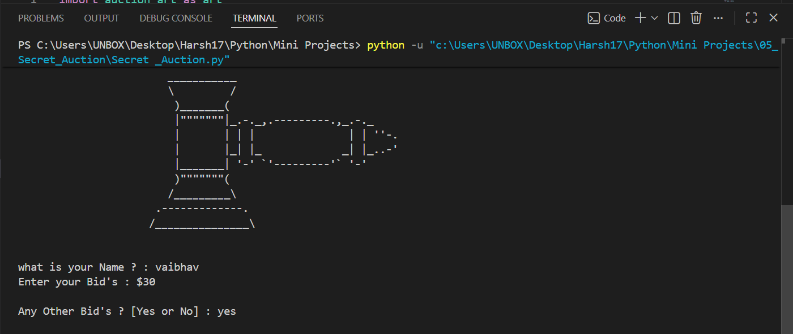
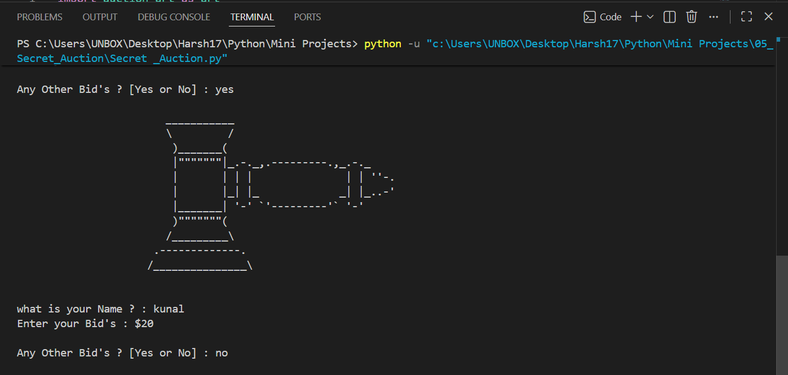
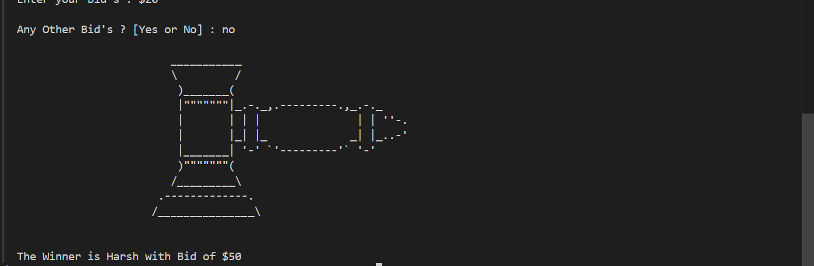

# 🔨 Secret Auction Program

A **console-based Secret Auction Program** built with Python that collects bids from multiple participants, stores them securely using a dictionary, and determines the highest bidder at the end of the auction.

   

---

# 📖 Project Overview

This project was developed to practice Python fundamentals such as dictionaries, functions, loops, conditional statements, user input handling, and finding the maximum value in a collection.

Each participant enters their name and bid amount. Once all bids have been submitted, the program automatically identifies the highest bidder and announces the winner.

---

# ✨ Features

* 🔨 Interactive auction bidding
* 👥 Multiple participant support
* 💰 Stores bids using a Python dictionary
* 🏆 Automatically determines the highest bidder
* 🎨 Custom ASCII auction logo
* 📦 Modular project structure
* ⚡ Simple console interface

---

# ⚙️ How It Works

1. Run the program.
2. Enter the bidder's name.
3. Enter the bid amount.
4. Choose whether another participant wants to bid.
5. Repeat until all bids are entered.
6. The program finds the highest bid.
7. The winner is announced.

---

# 📂 Project Structure

```text
05_Secret_Auction/
│
├── README.md
├── Secret_Auction.py
├── auction_art.py
└── Screenshot/
    ├── 1.png
    ├── 2.png
    ├── 3.png
    └── 4.png
```

---

# 🛠️ Technologies Used

* Python 3
* Dictionaries
* Functions
* Loops
* Conditional Statements
* Console Input/Output

---

# 🚀 Getting Started

### Clone the repository

```bash
git clone https://github.com/Harsh-Belekar/Python-Projects.git
```

### Navigate to the project folder

```bash
cd Python-Projects/05_Secret_Auction
```

### Run the program

```bash
python Secret_Auction.py
```

---

# 📸 Screenshots

## First Bid



---

## Second Bid



---

## Third Bid



---

## Winner Announcement



---

# 🧠 Python Concepts Practiced

* Variables
* Dictionaries
* Functions
* Loops (`while`, `for`)
* Conditional Statements
* User Input
* Dictionary Traversal
* Finding Maximum Values
* Modular Programming

---

# 📚 Files Description

## `Secret_Auction.py`

Contains the complete auction logic including:

* Collecting bidder information
* Storing bids in a dictionary
* Repeated bidding loop
* Determining the highest bidder
* Displaying the winner

---

## `auction_art.py`

Contains the ASCII auction logo displayed throughout the application.

Separating artwork from the application logic improves readability and code organization.

---

# 🏆 Winner Selection Logic

The program stores each participant's bid in a Python dictionary.

Example:

```text
{
    "Alice": 250,
    "Bob": 320,
    "Charlie": 275
}
```

The program then iterates through the dictionary to find the highest bid and announces the winner.

---

# 🔮 Future Improvements

Possible enhancements for future versions:

* 🧹 Clear the console after each bid to keep bids secret
* 🔄 Restart the auction after completion
* 🛡️ Validate user input
* 💵 Support decimal bid amounts
* 📊 Display all bids after the auction ends
* 💾 Save auction results to a file
* 🖥️ GUI version using Tkinter
* 🏢 Multiple auction rounds

---

# 🎯 Learning Outcomes

Through this project, I learned how to:

* Work with Python dictionaries
* Store and retrieve key-value pairs
* Traverse dictionaries using loops
* Find maximum values programmatically
* Organize code using functions
* Build interactive console applications
* Separate project assets into reusable modules

---

# 📂 More Projects

This project is part of my **Python Projects Portfolio**, a collection of Python projects covering:

* 🎮 Games
* 🖥️ GUI Applications
* 🤖 Automation
* 🌐 API Integrations
* 📊 Data Processing
* 🧩 Python Fundamentals

*Explore the repository to discover more projects and follow my Python learning journey.*

***⭐ If you like this project, don't forget to star the repository!***
