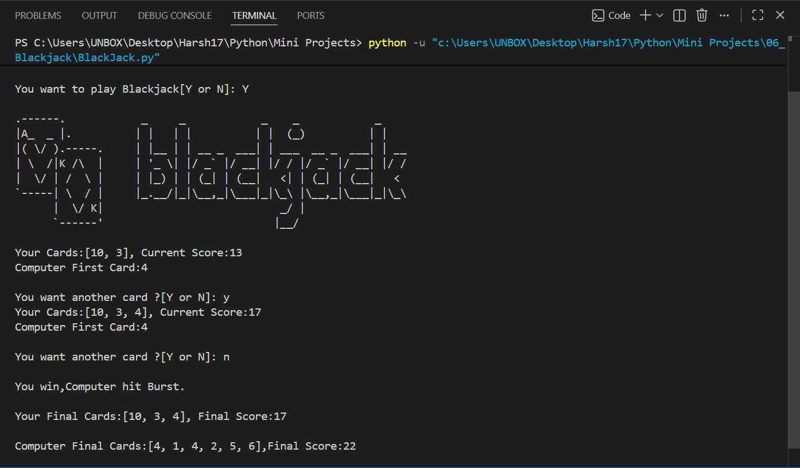

# 🃏 Blackjack Game

A **console-based Blackjack game** built with Python where the player competes against the computer following the basic rules of Blackjack. The game features random card dealing, automatic dealer decisions, Blackjack detection, score calculation, and replay functionality.

   

---

# 📖 Project Overview

This project was developed to practice Python programming concepts such as functions, loops, conditional statements, lists, modular programming, randomization, and implementing real-world game logic.

The player attempts to beat the computer by getting a card total closer to **21** without exceeding it.

---

# ✨ Features

* 🃏 Interactive Blackjack gameplay
* 🎲 Random card generation
* 🤖 Automatic computer (dealer) logic
* 🏆 Blackjack detection
* 💥 Bust detection
* 📊 Automatic score calculation
* 🔄 Play Again functionality
* 🎨 Custom ASCII Blackjack logo
* 📦 Modular project structure

---

# 🎮 Gameplay

1. Start a new Blackjack game.
2. Both the player and the computer receive two cards.
3. Only the computer's first card is revealed.
4. Choose whether to draw another card.
5. The computer automatically draws cards until its score reaches **17** or higher.
6. The winner is determined according to Blackjack rules.
7. Play another round without restarting the program.

---

# 📂 Project Structure

```text
06_Blackjack/
│
├── README.md
├── BlackJack.py
├── blackjack_art.py
└── Screenshot/
    └── 1.png
```

---

# 🛠️ Technologies Used

* Python 3
* Random Module
* Functions
* Lists
* Loops
* Conditional Statements
* Console Input/Output

---

# 🚀 Getting Started

### Clone the repository

```bash
git clone https://github.com/Harsh-Belekar/Python-Projects.git
```

### Navigate to the project folder

```bash
cd Python-Projects/06_Blackjack
```

### Run the program

```bash
python BlackJack.py
```

---

# 📸 Screenshot

## Gameplay



---

# 🧠 Python Concepts Practiced

* Variables
* Lists
* Functions
* Loops (`while`, `for`)
* Conditional Statements
* User Input
* Random Module
* Modular Programming
* Game Logic
* Score Calculation

---

# 📚 Files Description

## `BlackJack.py`

Contains the complete Blackjack game logic including:

* Random card generation
* Player and dealer card management
* Score calculation
* Blackjack detection
* Bust detection
* Winner determination
* Replay functionality

---

## `blackjack_art.py`

Contains the ASCII Blackjack logo displayed when the game starts.

Separating visual assets from the game logic keeps the project organized and easier to maintain.

---

# 🃏 Blackjack Rules Implemented

The game follows these basic Blackjack rules:

* 🃏 Number cards retain their face values.
* 👑 Face cards (Jack, Queen, King) are worth **10**.
* 🅰️ Ace is initially worth **11** (adjusted in your implementation when needed).
* 🎯 A score of **21 with two cards** is treated as Blackjack.
* 💥 A score greater than **21** results in a Bust.
* 🤖 The computer automatically draws cards until its score reaches **17** or higher.
* 🏆 The player closest to **21** without busting wins.

---

# 🔮 Future Improvements

Possible enhancements for future versions:

* 🅰️ Smarter Ace value handling throughout the game
* 💰 Betting system
* 📊 Scoreboard
* 🎮 Multiple rounds with accumulated scores
* 👥 Multiplayer mode
* 🎨 GUI version using Tkinter
* 🕹️ Pygame version
* 🔊 Sound effects
* 🃏 Multiple decks of cards
* 📈 Game statistics

---

# 🎯 Learning Outcomes

Through this project, I learned how to:

* Simulate a real-world card game using Python
* Generate random game events
* Build reusable functions
* Implement decision-making logic
* Calculate scores dynamically
* Manage game state using loops
* Organize projects using multiple Python modules

---

# 📂 More Projects

This project is part of my **Python Projects Portfolio**, a collection of Python projects covering:

* 🎮 Games
* 🖥️ GUI Applications
* 🤖 Automation
* 🌐 API Integrations
* 📊 Data Processing
* 🧩 Python Fundamentals

*Explore the repository to discover more projects and follow my Python learning journey.*

***⭐ If you like this project, don't forget to star the repository!***
