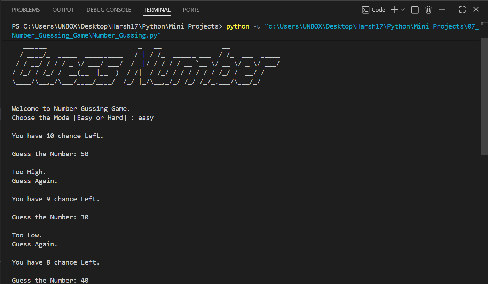
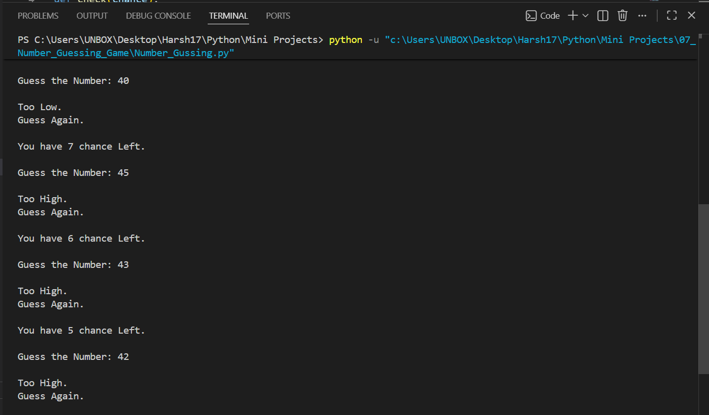
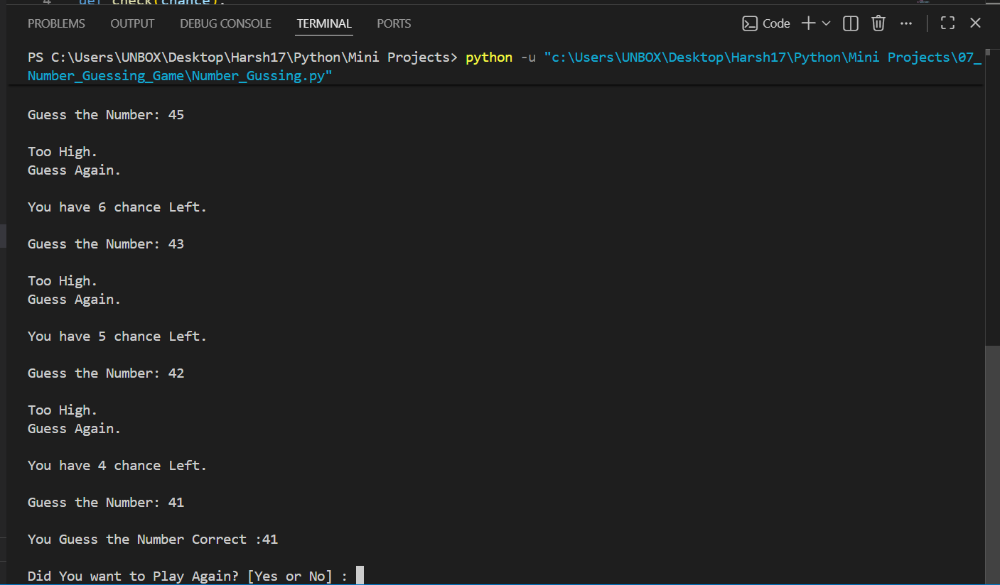

# 🎯 Number Guessing Game

A **console-based Number Guessing Game** built with Python where players try to guess a randomly generated number between **1 and 100**. The game offers **Easy** and **Hard** difficulty modes, provides hints after each guess, and allows players to play multiple rounds.


   

---

# 📖 Project Overview

This project was developed to strengthen Python fundamentals such as loops, functions, conditional statements, random number generation, user input handling, and game logic.

Players receive feedback after every guess ("Too High" or "Too Low") and must identify the correct number before running out of chances.

---

# ✨ Features

* 🎯 Random number generation (1–100)
* 🎮 Two difficulty levels

  * 🟢 Easy Mode (10 chances)
  * 🔴 Hard Mode (5 chances)
* 💡 Hint system (Too High / Too Low)
* 🔄 Play Again functionality
* 🎨 Custom ASCII game logo
* 📦 Modular project structure
* 💻 Interactive console interface

---

# 🎮 Gameplay

1. Start the game.
2. Choose a difficulty level:

   * **Easy** → 10 chances
   * **Hard** → 5 chances
3. Guess a number between **1 and 100**.
4. Receive a hint after each incorrect guess:

   * 📈 Too High
   * 📉 Too Low
5. Continue guessing until:

   * 🎉 You find the correct number, or
   * ❌ You run out of chances.
6. Choose whether to play another round.

---

# 📂 Project Structure

```text
07_Number_Guessing_Game/
│
├── README.md
├── Number_Gussing.py
├── guess_art.py
└── Screenshot/
    ├── 1.png
    ├── 2.png
    └── 3.png
```

---

# 🛠️ Technologies Used

* Python 3
* Random Module
* Functions
* Loops
* Conditional Statements
* Console Input/Output

---

# 🚀 Getting Started

### Clone the repository

```bash
git clone https://github.com/Harsh-Belekar/Python-Projects.git
```

### Navigate to the project folder

```bash
cd Python-Projects/07_Number_Guessing_Game
```

### Run the program

```bash
python Number_Gussing.py
```

---

# 📸 Screenshots

## Starting the Game



---

## Guessing the Number



---

## Correct Guess / Game Over



---

# 🧠 Python Concepts Practiced

* Variables
* Functions
* Loops (`while`)
* Conditional Statements
* Random Number Generation
* User Input
* Function Parameters
* Game Logic
* Modular Programming

---

# 📚 Files Description

## `Number_Gussing.py`

Contains the complete game logic including:

* Random number generation
* Difficulty selection
* Guess validation
* Hint generation
* Chance management
* Play Again functionality

---

## `guess_art.py`

Contains the ASCII logo displayed when the game starts.

Keeping the artwork separate from the game logic improves readability and project organization.

---

# 🎲 Game Rules

* The computer randomly selects a number between **1 and 100**.
* Choose either:

  * 🟢 **Easy Mode** → 10 chances
  * 🔴 **Hard Mode** → 5 chances
* After each incorrect guess, you'll receive a hint:

  * **Too High**
  * **Too Low**
* Guess the correct number before running out of chances.
* You can start a new game after each round.

---

# 🔮 Future Improvements

Possible enhancements for future versions:

* 🏆 Scoreboard
* ⏱️ Timer mode
* 📊 Guess history
* 📈 Track the number of attempts
* 🎚️ Additional difficulty levels
* 💡 Hint based on guess proximity
* 🖥️ GUI version using Tkinter
* 🎮 Pygame version
* 🔊 Sound effects
* 🌍 Multiplayer mode

---

# 🎯 Learning Outcomes

Through this project, I learned how to:

* Generate random numbers using Python
* Design interactive console games
* Build reusable functions
* Implement game loops
* Create difficulty levels
* Provide dynamic feedback based on user input
* Manage game state effectively

---

# 📂 More Projects

This project is part of my **Python Projects Portfolio**, a collection of Python projects covering:

* 🎮 Games
* 🖥️ GUI Applications
* 🤖 Automation
* 🌐 API Integrations
* 📊 Data Processing
* 🧩 Python Fundamentals

*Explore the repository to discover more projects and follow my Python learning journey.*

***⭐ If you like this project, don't forget to star the repository!***
