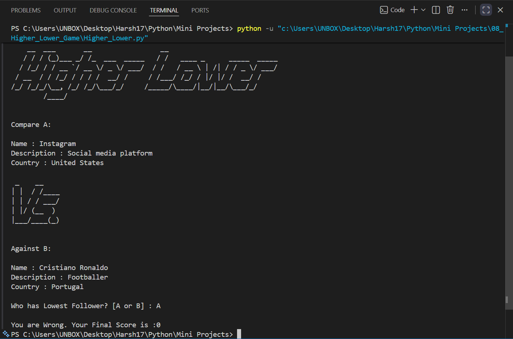

# 📈 Higher Lower Game

A **console-based Higher Lower Game** built with Python where players compare two popular celebrities, brands, or organizations and guess which one has the **higher or lower Instagram follower count**. The game features a dataset of well-known personalities, random comparisons, score tracking, and endless gameplay until an incorrect answer is given.

   

---

# 📖 Project Overview

This project was developed to practice Python fundamentals including dictionaries, lists, functions, loops, conditional statements, randomization, data handling, and comparison logic.

The player is presented with two randomly selected Instagram accounts and must correctly predict which account has the **higher** or **lower** follower count to continue the game.

---

# ✨ Features

* 📊 Compare Instagram follower counts
* 🎲 Random account selection
* 🔀 Random "Higher" or "Lower" questions
* 🏆 Score tracking
* 📚 Dataset of celebrities, brands, and organizations
* 🎨 Custom ASCII game logo
* ⚔️ VS comparison display
* 📦 Modular project structure
* 💻 Interactive console gameplay

---

# 🎮 Gameplay

1. Start the game.
2. Two random Instagram accounts are displayed.
3. The game randomly asks:

   * 📈 Who has **Higher** followers?
   * 📉 Who has **Lower** followers?
4. Enter **A** or **B**.
5. A correct answer increases your score.
6. The game continues until an incorrect guess is made.
7. Your final score is displayed.

---

# 📂 Project Structure

```text
08_Higher_Lower_Game/
│
├── README.md
├── Higher_Lower.py
├── high_low_art.py
└── Screenshot/
    └── 1.png
```

---

# 🛠️ Technologies Used

* Python 3
* Random Module
* Dictionaries
* Lists
* Functions
* Loops
* Conditional Statements
* Console Input/Output

---

# 🚀 Getting Started

### Clone the repository

```bash
git clone https://github.com/Harsh-Belekar/Python-Projects.git
```

### Navigate to the project folder

```bash
cd Python-Projects/08_Higher_Lower_Game
```

### Run the program

```bash
python Higher_Lower.py
```

---

# 📸 Screenshot

## Gameplay



---

# 🧠 Python Concepts Practiced

* Variables
* Lists
* Dictionaries
* Functions
* Loops (`while`, `for`)
* Conditional Statements
* Random Module
* Dictionary Traversal
* Comparison Logic
* Score Tracking
* Modular Programming

---

# 📚 Files Description

## `Higher_Lower.py`

Contains the complete game logic including:

* Random account selection
* Displaying account information
* Follower comparison
* Score management
* Game loop
* Winner determination

---

## `high_low_art.py`

Contains all reusable game assets including:

* ASCII game logo
* VS banner
* Instagram account dataset

Separating the dataset and artwork from the game logic makes the project easier to maintain and extend.

---

# 📊 Dataset Overview

The project includes a predefined dataset containing popular Instagram accounts such as:

* 🌐 Social media platforms
* ⚽ Sports personalities
* 🎵 Musicians
* 🎬 Actors and actresses
* 🏢 Global brands
* 🏆 Sports clubs
* 🚀 Organizations

Each account stores:

* Name
* Follower Count
* Description
* Country

---

# 🎲 Game Rules

* Two accounts are shown in every round.
* The game randomly asks for either:

  * **Higher Followers**
  * **Lower Followers**
* Enter **A** or **B**.
* Every correct answer earns **1 point**.
* The game ends after the first incorrect answer.
* Your final score is displayed.

---

# 🔮 Future Improvements

Possible enhancements for future versions:

* 📂 Load account data from a JSON or CSV file
* 🌍 Larger celebrity database
* 🔄 Prevent repeated account comparisons
* 📈 Display follower counts after each round
* 🏅 High score system
* 🎚️ Difficulty levels
* 🖥️ GUI version using Tkinter
* 🎮 Pygame version
* 🌐 Fetch live Instagram statistics using an API (where available)

---

# 🎯 Learning Outcomes

Through this project, I learned how to:

* Work with lists of dictionaries
* Build comparison-based game logic
* Randomly select and compare data
* Track player scores
* Create reusable functions
* Organize projects using multiple modules
* Develop interactive console applications

---

# 📂 More Projects

This project is part of my **Python Projects Portfolio**, a collection of Python projects covering:

* 🎮 Games
* 🖥️ GUI Applications
* 🤖 Automation
* 🌐 API Integrations
* 📊 Data Processing
* 🧩 Python Fundamentals

*Explore the repository to discover more projects and follow my Python learning journey.*

***⭐ If you like this project, don't forget to star the repository!***
