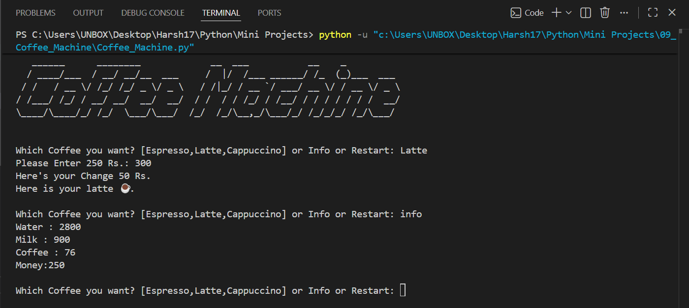

# ☕ Coffee Machine Simulator

A **console-based Coffee Machine Simulator** built with Python that allows users to order different coffee drinks while managing ingredients, processing payments, tracking profits, and monitoring available resources. The project demonstrates **Object-Oriented Programming (OOP)** and modular application design.

   

---

# 📖 Project Overview

This project simulates the basic functionality of a real coffee vending machine.

Users can:

- Select a coffee
- Pay for the selected drink
- Receive change (if applicable)
- View available resources
- Restart the machine to refill ingredients

The application automatically checks resource availability before preparing the selected coffee.

---

# ✨ Features

- ☕ Three coffee options
  - Espresso
  - Latte
  - Cappuccino
- 💧 Automatic resource management
- 💰 Payment processing
- 💵 Change calculation
- 📊 Profit tracking
- 📋 Machine information report
- 🔄 Restart machine (refill resources)
- 🏗️ Object-Oriented Programming (OOP)
- 📦 Modular project structure

---

# ⚙️ How It Works

1. Start the coffee machine.
2. Select one of the available drinks.
3. The machine checks ingredient availability.
4. Enter the required payment.
5. If payment is successful:
   - Resources are deducted.
   - Coffee is prepared.
   - Change is returned (if applicable).
6. Use **Info** to view current resources and profit.
7. Use **Restart** to refill all ingredients.

---

# 📂 Project Structure

```text
09_Coffee_Machine/
│
├── README.md
├── Coffee_Machine.py
├── coffee_maker.py
├── coffee_art.py
└── Screenshot/
    └── 1.png
```

---

# 🛠️ Technologies Used

- Python 3
- Object-Oriented Programming (OOP)
- Classes & Objects
- Dictionaries
- Nested Dictionaries
- Functions
- Loops
- Conditional Statements
- Console Input/Output

---

# 🚀 Getting Started

### Clone the repository

```bash
git clone https://github.com/Harsh-Belekar/Python-Projects.git
```

### Navigate to the project folder

```bash
cd Python-Projects/09_Coffee_Machine
```

### Run the program

```bash
python Coffee_Machine.py
```

---

# 📸 Screenshot

## Coffee Machine



---

# 🧠 Python Concepts Practiced

- Variables
- Functions
- Classes & Objects
- Object-Oriented Programming
- Dictionaries
- Nested Dictionaries
- Loops
- Conditional Statements
- Method Calls
- Modular Programming
- Resource Management

---

# 📚 Files Description

## `Coffee_Machine.py`

The main entry point of the application.

Responsibilities include:

- Starting the coffee machine
- Processing user commands
- Tracking profits
- Restarting the machine
- Displaying machine information

---

## `coffee_maker.py`

Contains the `CoffeeMaker` class responsible for:

- Checking ingredient availability
- Processing payments
- Returning change
- Preparing coffee
- Updating available resources

---

## `coffee_art.py`

Stores all reusable project assets including:

- ASCII Coffee Machine logo
- Coffee menu
- Ingredient requirements
- Coffee prices
- Initial resource values

Keeping configuration data separate from the application logic improves readability and maintainability.

---

# ☕ Available Drinks

| Coffee | Water | Milk | Coffee | Price |
|---------|------:|-----:|-------:|------:|
| Espresso | 50 ml | — | 18 g | ₹150 |
| Latte | 200 ml | 100 ml | 24 g | ₹250 |
| Cappuccino | 200 ml | 150 ml | 24 g | ₹300 |

---

# 💧 Resource Management

The simulator keeps track of:

- 💧 Water
- 🥛 Milk
- ☕ Coffee

Before preparing a drink, the machine verifies that enough ingredients are available.

If resources are insufficient, the order is rejected.

---

# 💰 Payment System

The simulator supports:

- Entering payment manually
- Validating payment amount
- Returning change
- Rejecting insufficient payments
- Tracking total profit earned

---

# 🔄 Coffee Machine Workflow

```text
Start
   │
   ▼
Choose Coffee
   │
   ▼
Check Ingredients
   │
   ├── Not Available ❌
   │        │
   │        ▼
   │   Show Error
   │
   ▼
Enter Payment
   │
   ├── Insufficient ❌
   │        │
   │        ▼
   │   Refund Payment
   │
   ▼
Prepare Coffee
   │
   ▼
Update Resources
   │
   ▼
Serve Coffee ☕
```

---

# 🔮 Future Improvements

Possible enhancements for future versions:

- 🪙 Coin-based payment system
- 💳 UPI/Card payment simulation
- 🧾 Order history
- 📈 Sales statistics
- 🛒 Add custom coffee recipes
- 🧑‍💼 Admin mode
- 💾 Save machine state to a file
- 🖥️ GUI version using Tkinter
- 🎨 Modern graphical interface
- 🔊 Sound effects

---

# 🎯 Learning Outcomes

Through this project, I learned how to:

- Build applications using Object-Oriented Programming
- Organize code into multiple Python modules
- Work with nested dictionaries
- Simulate real-world systems
- Manage shared resources
- Process user payments
- Design reusable classes and methods

---

# 📂 More Projects

This project is part of my **Python Projects Portfolio**, a collection of Python projects covering:

- 🎮 Games
- ☕ Simulations
- 🖥️ GUI Applications
- 🤖 Automation
- 🌐 API Integrations
- 📊 Data Processing
- 🧩 Python Fundamentals

*Explore the repository to discover more projects and follow my Python learning journey.*

***⭐ If you like this project, don't forget to star the repository!***