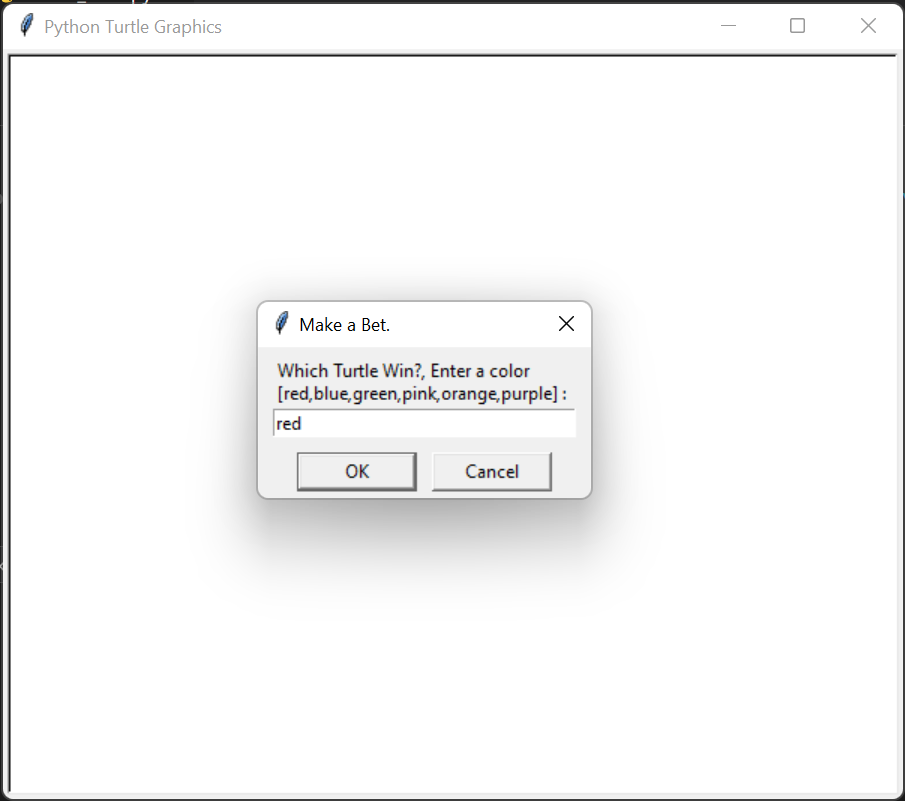
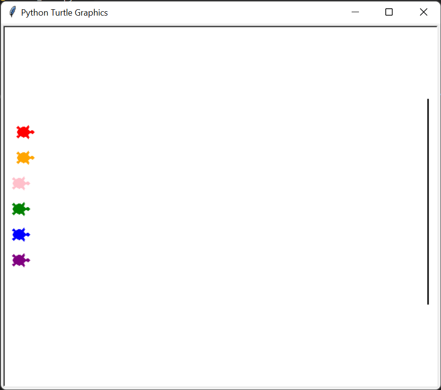
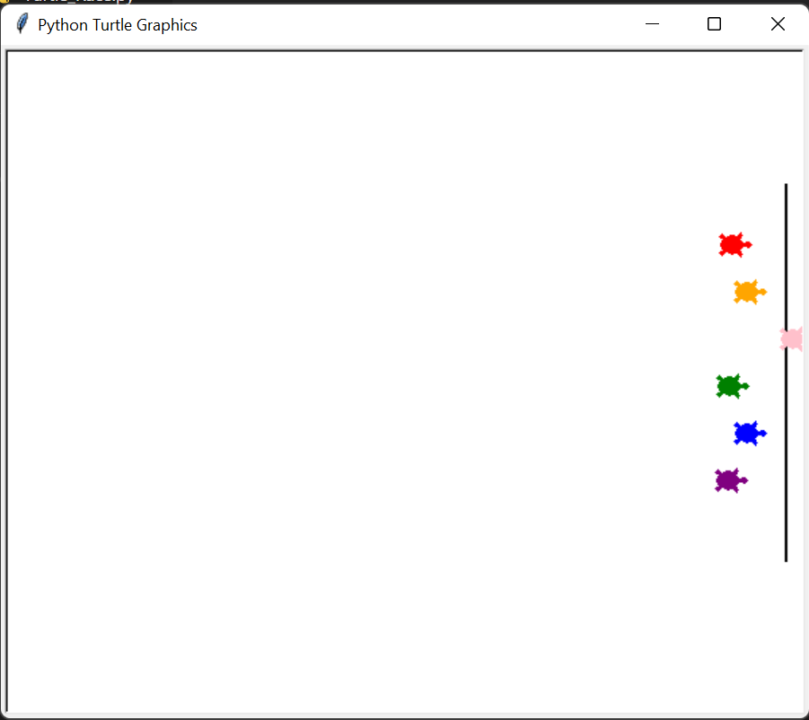
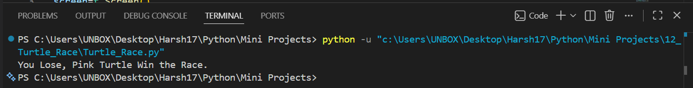

# 🐢 Turtle Race

A fun **Turtle Graphics racing game** built with Python where six colorful turtles compete in a randomized race. Before the race begins, the player places a bet by selecting a turtle color. Once the race starts, each turtle moves forward randomly until one crosses the finish line.

   

---

# 📖 Project Overview

This project demonstrates how to build an animated graphical application using Python's **Turtle Graphics** library.

The program creates multiple turtle objects, accepts a user's prediction, simulates a race using random movement, and announces whether the player's prediction was correct.

---

# ✨ Features

- 🐢 Six colorful racing turtles
- 🎲 Randomized race movement
- 🎯 User betting system
- 🏁 Finish line detection
- 🏆 Winner announcement
- 🎨 Turtle Graphics animation
- ⚡ Smooth real-time race simulation
- 💻 Beginner-friendly implementation

---

# 🎮 Gameplay

1. Launch the application.
2. Enter the color of the turtle you think will win.
3. Six turtles line up at the starting position.
4. The race begins automatically.
5. Each turtle moves forward by a random distance.
6. The first turtle to cross the finish line wins.
7. The game announces whether your prediction was correct.

---

# 📂 Project Structure

```text
12_Turtle_Race/
│
├── README.md
├── Turtle_Race.py
└── Screenshot/
    ├── 1.png
    ├── 2.png
    ├── 3.png
    └── 4.png
```

---

# 🛠️ Technologies Used

- Python 3
- Turtle Graphics
- Random Module
- Animation
- User Input Dialog
- Loops
- Coordinate System

---

# 🚀 Getting Started

### Clone the repository

```bash
git clone https://github.com/Harsh-Belekar/Python-Projects.git
```

### Navigate to the project folder

```bash
cd Python-Projects/12_Turtle_Race
```

### Run the program

```bash
python Turtle_Race.py
```

---

# 📸 Screenshots

## Place Your Bet



---

## Race Start



---

## Race Finish



---

## Winner Announcement



---

# 🧠 Python Concepts Practiced

- Turtle Graphics
- Multiple Objects
- Random Module
- Animation
- Coordinate System
- Lists
- Loops
- Conditional Statements
- User Input
- Event-Driven Programming

---

# 📚 File Description

## `Turtle_Race.py`

This file contains the complete game logic, including:

- Turtle object creation
- Screen setup
- User bet input
- Starting position setup
- Finish line creation
- Random turtle movement
- Winner detection
- Result announcement

---

# 🏁 Race Workflow

```text
Start Program
      │
      ▼
Create Game Window
      │
      ▼
Ask User for Bet
      │
      ▼
Create 6 Turtles
      │
      ▼
Position Turtles
      │
      ▼
Draw Finish Line
      │
      ▼
Start Race
      │
      ▼
Move Every Turtle Randomly
      │
      ▼
Any Turtle Cross Finish Line?
      │
 ┌────┴────┐
 │         │
No        Yes
 │         │
 ▼         ▼
Continue  Announce Winner
 Race
      │
      ▼
Compare with User Bet
      │
      ▼
Display Win / Lose Message
```

---

# 🐢 Turtle Colors

The race includes six colorful turtles:

- 🔴 Red
- 🟠 Orange
-  ⚪ Pink
- 🟢 Green
- 🔵 Blue
- 🟣 Purple

Each turtle has an equal chance of winning because movement is generated randomly.

---

# 🎨 Project Output

The application provides:

- Interactive betting system
- Animated turtle race
- Random winner every game
- Instant result announcement
- Smooth Turtle Graphics animation

Every race is different due to random movement.

---

# 🔮 Future Improvements

Possible enhancements for future versions:

- 🎵 Add background music and sound effects
- 🏆 Multiple race rounds
- 💰 Virtual coin betting system
- 📊 Win/Loss statistics
- 🎛️ Adjustable race speed
- 🐢 Custom turtle names
- 🌈 More turtle colors
- 🎮 Multiplayer betting
- 🏁 Different race tracks
- 🖥️ Scoreboard and GUI improvements

---

# 🎯 Learning Outcomes

Through this project, I learned how to:

- Build animated applications using Turtle Graphics
- Create and manage multiple Turtle objects
- Simulate movement using random values
- Accept user input through graphical dialogs
- Detect collisions and finish conditions
- Work with coordinates and animation loops
- Develop interactive graphical games

---

# 📂 More Projects

This project is part of my **Python Projects Portfolio**, a collection of Python projects covering:

- 🎮 Games
- 🎨 Graphics Programming
- 🖥️ GUI Applications
- 🤖 Automation
- 🌐 API Integrations
- 📊 Data Processing
- 🧩 Python Fundamentals

*Explore the repository to discover more projects and follow my Python learning journey.*

***⭐ If you like this project, don't forget to star the repository!***
