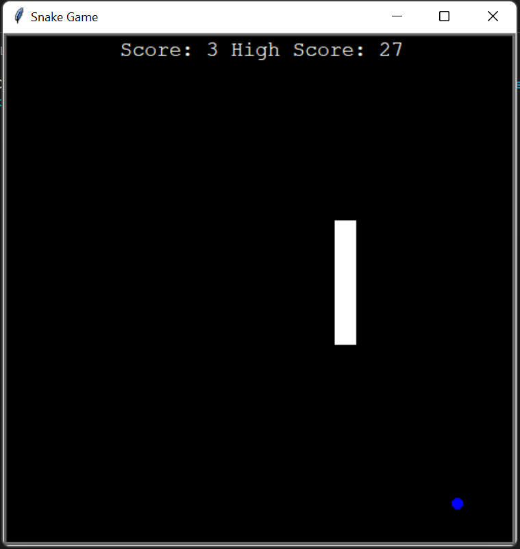
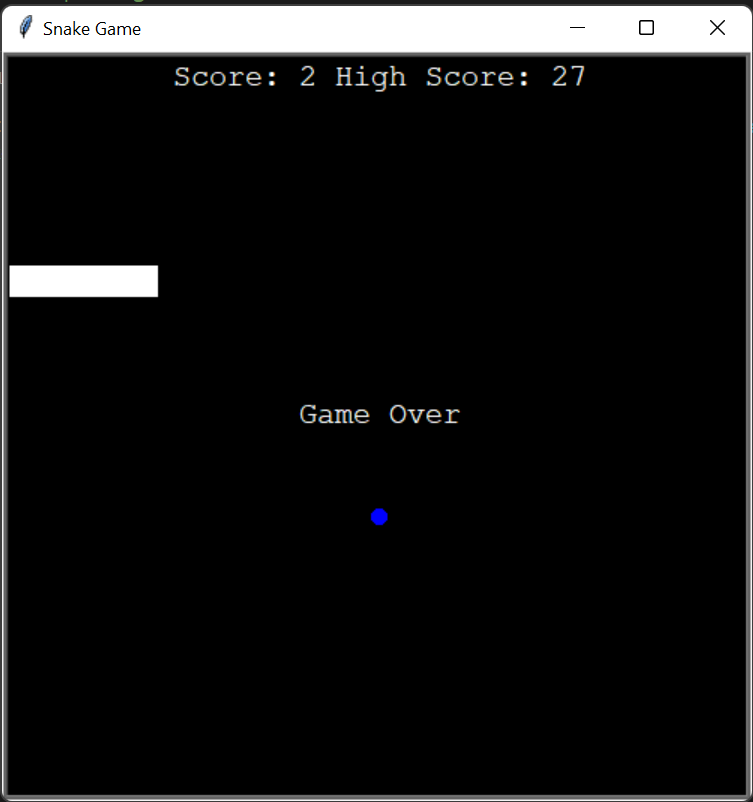

# 🐍 Snake Game

A classic **Snake Game** built using **Python Turtle Graphics** with object-oriented programming. Control the snake, eat food to grow longer, increase your score, and try to beat your highest score while avoiding collisions with walls and your own body.

       

---

## 📸 Screenshots

### Gameplay


### Game Over


---

## ✨ Features

- 🎮 Classic Snake gameplay
- 🐍 Smooth snake movement using arrow keys
- 🍎 Random food generation
- 📈 Real-time score tracking
- 🏆 High score saved using a text file
- 💾 Persistent high score between game sessions
- 🚧 Collision detection with walls
- 🔄 Self-collision detection
- 🧱 Object-Oriented Programming (OOP) design
- ⚡ Fast and responsive gameplay using Turtle animation

---

## 📂 Project Structure

```
13_Snake_Game/
│
├── Assets/
│   └── Snake_data.txt
│
├── Src/
│   ├── Food.py
│   ├── Score_Board.py
│   ├── Snake.py
│   └── Snake_Game.py
│
├── Screenshot/
│   ├── 1.png
│   └── 2.png
│
└── README.md
```

---

## 🛠️ Technologies Used

- Python 3
- Turtle Graphics
- Object-Oriented Programming (OOP)
- Random Module
- File Handling

---

## 🚀 How to Run

1. Clone this repository

```bash
git clone https://github.com/Harsh-Belekar/Python-Mini-Projects.git
```

2. Navigate to the project folder

```bash
cd Python-Mini-Projects/13_Snake_Game/Src
```

3. Run the game

```bash
python Snake_Game.py
```

---

## 🎮 Controls

| Key | Action |
|------|--------|
| ⬆️ Up Arrow | Move Up |
| ⬇️ Down Arrow | Move Down |
| ⬅️ Left Arrow | Move Left |
| ➡️ Right Arrow | Move Right |

---

## 🎯 Gameplay

- Control the snake using the arrow keys.
- Eat the blue food to increase your score.
- Every food eaten adds a new segment to the snake.
- Avoid hitting the walls.
- Avoid colliding with your own body.
- The highest score is automatically saved in `Snake_data.txt`.

---

## 📚 Concepts Practiced

- Classes and Objects
- Inheritance
- Turtle Graphics
- Event Handling
- Keyboard Input
- Collision Detection
- File Handling
- Game Loop
- Object Composition
- Random Number Generation

---

## 📄 License

This project is created for learning and educational purposes.

---

# 📂 More Projects

This project is part of my **Python Projects Portfolio**, a collection of Python projects covering:

- 🎮 Games
- 🎨 Graphics Programming
- 🖥️ GUI Applications
- 🤖 Automation
- 🌐 API Integrations
- 📊 Data Processing
- 🧩 Python Fundamentals

*Explore the repository to discover more projects and follow my Python learning journey.*

***⭐ If you like this project, don't forget to star the repository!***
