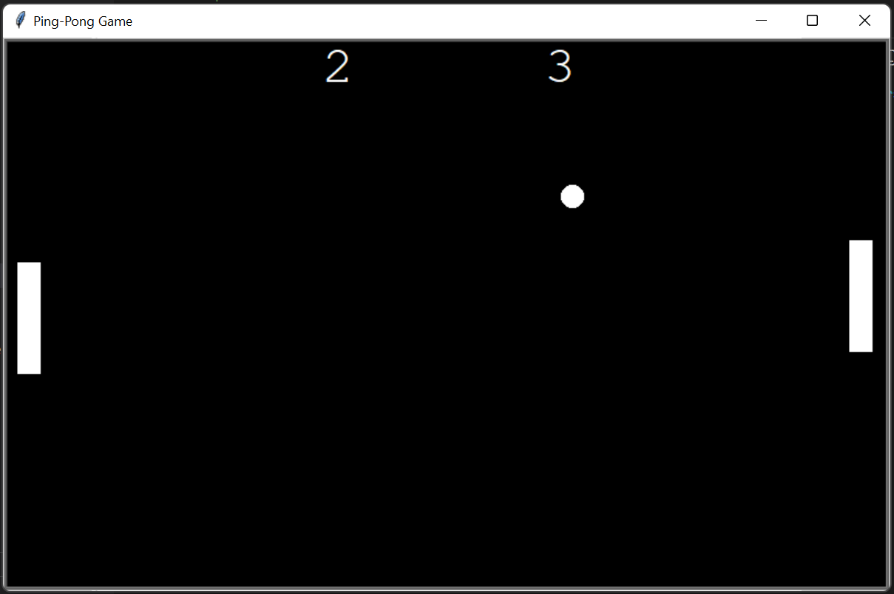

# 🏓 Ping Pong Game

A classic **2-Player Ping Pong Game** built using **Python Turtle Graphics** and **Object-Oriented Programming (OOP)**. Control the paddles, bounce the ball back and forth, score points against your opponent, and be the first player to reach **11 points** to win the match.

   
  

---

## 📸 Screenshot

### Gameplay


---

## ✨ Features

- 🏓 Classic 2-player Ping Pong gameplay
- 🎮 Keyboard controls for both players
- ⚡ Smooth ball movement and animation
- 💥 Ball bounces off paddles and walls
- 🚀 Ball speed increases after every paddle hit
- 📊 Live scoreboard
- 🏆 First player to reach 11 points wins
- 🧱 Built using Object-Oriented Programming (OOP)
- 🎨 Simple and clean Turtle Graphics interface

---

## 📂 Project Structure

```text
14_Ping_Pong_Game/
│
├── Src/
│   ├── Ball.py
│   ├── Paddle.py
│   ├── Ping-Pong Game.py
│   └── Score_Board.py
│
├── Screenshot/
│   └── 1.png
│
└── README.md
```

---

## 🛠️ Technologies Used

- Python 3
- Turtle Graphics
- Object-Oriented Programming (OOP)
- Time Module

---

## 🚀 How to Run

1. Clone this repository

```bash
git clone https://github.com/Harsh-Belekar/Python-Projects.git
```

2. Navigate to the project folder

```bash
cd Python-Projects/14_Ping_Pong_Game/Src
```

3. Run the game

```bash
python "Ping-Pong Game.py"
```

---

## 🎮 Controls

| Player | Keys | Action |
|---------|------|--------|
| Left Player | **A** | Move Up |
| Left Player | **D** | Move Down |
| Right Player | **↑** | Move Up |
| Right Player | **↓** | Move Down |

---

## 🎯 Gameplay

- Two players compete against each other.
- Use your paddle to keep the ball in play.
- Every time the opponent misses the ball, you earn **1 point**.
- The ball becomes faster after every successful paddle hit, increasing the game's difficulty.
- The first player to score **11 points** wins the match.

---

## 📂 Source Files

### `Ball.py`

Responsible for the ball mechanics.

Features:

- Creates the game ball
- Controls ball movement
- Detects wall collisions
- Handles paddle collisions
- Increases ball speed after each hit
- Resets the ball after a point is scored

---

### `Paddle.py`

Implements the paddle class for both players.

Features:

- Creates left and right paddles
- Handles player movement
- Restricts paddles within screen boundaries
- Uses a single reusable class for both paddles

---

### `Score_Board.py`

Manages the game's scoring system.

Features:

- Displays live scores
- Updates player scores
- Detects the winning player
- Displays the winner on screen

---

### `Ping-Pong Game.py`

Main game controller.

Responsibilities:

- Initializes the game window
- Creates all game objects
- Registers keyboard controls
- Runs the game loop
- Detects collisions
- Updates scores
- Ends the game when a player wins

---

## 📚 Concepts Practiced

- Object-Oriented Programming (OOP)
- Classes & Objects
- Inheritance
- Turtle Graphics
- Keyboard Event Handling
- Animation
- Collision Detection
- Game Loop
- Coordinate System
- Real-time Score Tracking
- Modular Programming

---

## 📄 License

This project is created for learning and educational purposes.

---

# 📂 More Projects

This project is part of my **Python Projects Portfolio**, a collection of Python projects covering:

- 🎮 Games
- 🎨 Graphics Programming
- 🖥️ GUI Applications
- 🤖 Automation
- 🌐 API Integrations
- 📊 Data Processing
- 🧩 Python Fundamentals

*Explore the repository to discover more projects and follow my Python learning journey.*

***⭐ If you like this project, don't forget to star the repository!***
