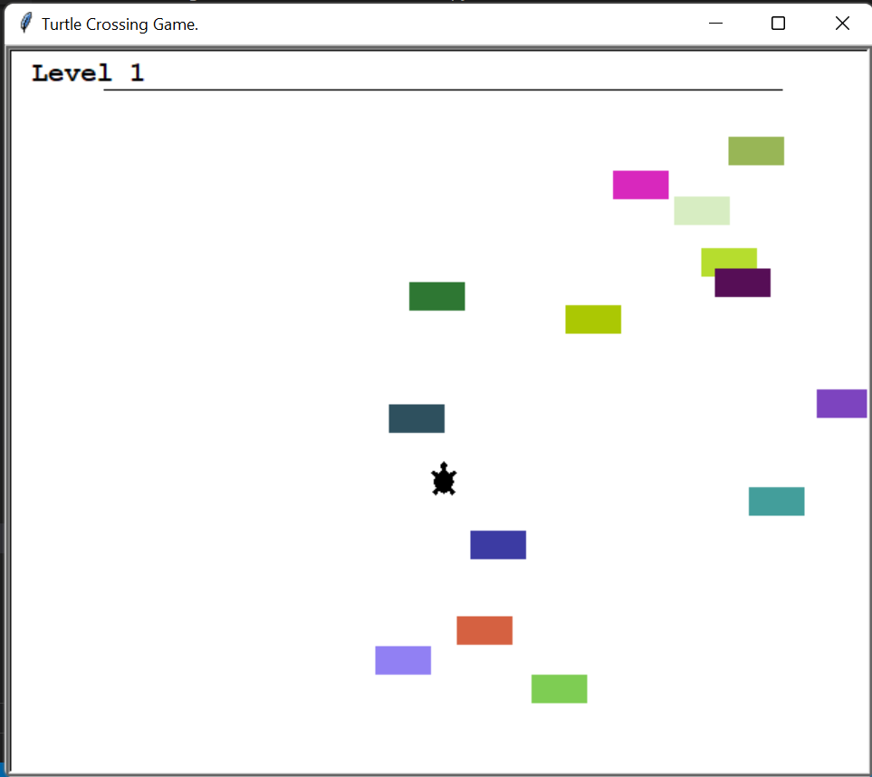
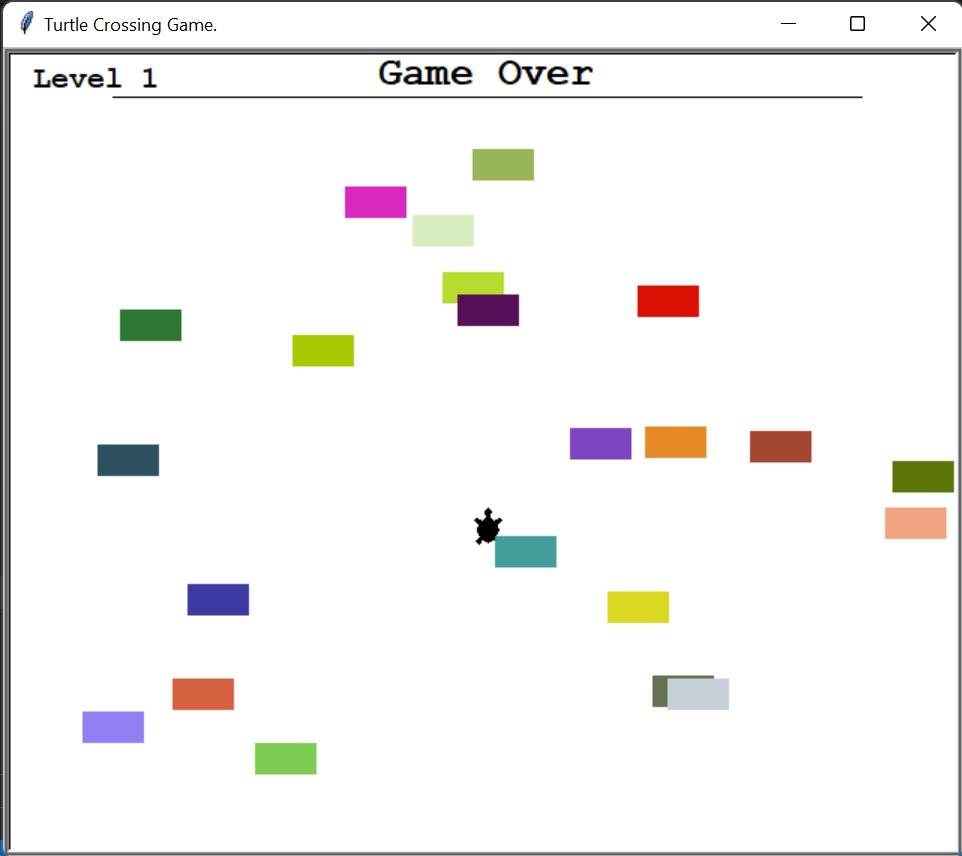

# 🐢 Turtle Road Crossing Game

A fun arcade-style **Turtle Road Crossing Game** built using **Python Turtle Graphics** and **Object-Oriented Programming (OOP)**. Guide the turtle safely across a busy road filled with moving cars, level up after each successful crossing, and avoid collisions to reach the final level and win the game.

       

---

## 📸 Screenshots

### Gameplay



### Game Over



---

## ✨ Features

* 🐢 Player-controlled turtle
* 🚗 Randomly generated moving cars
* 🌈 Cars with random colors
* 📈 Level progression system
* ⚡ Increasing difficulty with each level
* 🎮 Keyboard controls
* 💥 Collision detection
* 🏆 Win condition after completing all levels
* ❌ Game Over screen
* 🧱 Built using Object-Oriented Programming (OOP)

---

## 📂 Project Structure

```text
15_Turtle_Road_Crossing_Game/
│
├── Src/
│   ├── Car.py
│   ├── Player.py
│   ├── Score_Board.py
│   └── Turtle_Game.py
│
├── Screenshot/
│   ├── 1.png
│   └── 2.png
│
└── README.md
```

---

## 🛠️ Technologies Used

* Python 3
* Turtle Graphics
* Object-Oriented Programming (OOP)
* Random Module
* Time Module

---

## 🚀 How to Run

1. Clone this repository

```bash
git clone https://github.com/Harsh-Belekar/Python-Projects.git
```

2. Navigate to the project folder

```bash
cd Python-Projects/15_Turtle_Road_Crossing_Game/Src
```

3. Run the game

```bash
python Turtle_Game.py
```

---

## 🎮 Controls

| Key           | Action        |
| ------------- | ------------- |
| ⬆️ Up Arrow   | Move Forward  |
| ⬇️ Down Arrow | Move Backward |

---

## 🎯 Gameplay

* Control the turtle using the arrow keys.
* Cross the road while avoiding moving cars.
* Reach the finish line to advance to the next level.
* Each level increases the speed of the cars.
* Avoid collisions with cars.
* Reach **Level 6** to win the game.

---

## 📂 Source Files

### `Car.py`

Responsible for managing all traffic in the game.

Features:

* Creates cars at random intervals
* Generates random car colors
* Places cars at random positions
* Moves cars across the screen
* Maintains all active cars

---

### `Player.py`

Handles the player turtle.

Features:

* Creates the turtle character
* Sets the starting position
* Moves the turtle forward and backward
* Draws the finish line

---

### `Score_Board.py`

Manages the game's level system.

Features:

* Displays the current level
* Updates level progression
* Detects winning conditions
* Displays Game Over message
* Displays Win message

---

### `Turtle_Game.py`

Main game controller.

Responsibilities:

* Initializes all game objects
* Handles keyboard controls
* Runs the game loop
* Creates and moves traffic
* Detects collisions
* Manages level progression
* Controls game win and game over states

---

## 📚 Concepts Practiced

* Object-Oriented Programming (OOP)
* Classes & Objects
* Inheritance
* Turtle Graphics
* Keyboard Event Handling
* Animation
* Collision Detection
* Game Loop
* Random Object Generation
* Level Progression
* Modular Programming

---

## 🎓 Learning Outcomes

Through this project, I learned:

* Designing games using Object-Oriented Programming
* Managing multiple moving objects
* Implementing collision detection
* Creating level-based gameplay
* Handling keyboard events
* Building interactive applications using Turtle Graphics

---

## 📄 License

This project is created for learning and educational purposes.

---

# 📂 More Projects

This project is part of my **Python Projects Portfolio**, a collection of Python projects covering:

- 🎮 Games
- 🎨 Graphics Programming
- 🖥️ GUI Applications
- 🤖 Automation
- 🌐 API Integrations
- 📊 Data Processing
- 🧩 Python Fundamentals

*Explore the repository to discover more projects and follow my Python learning journey.*

***⭐ If you like this project, don't forget to star the repository!***