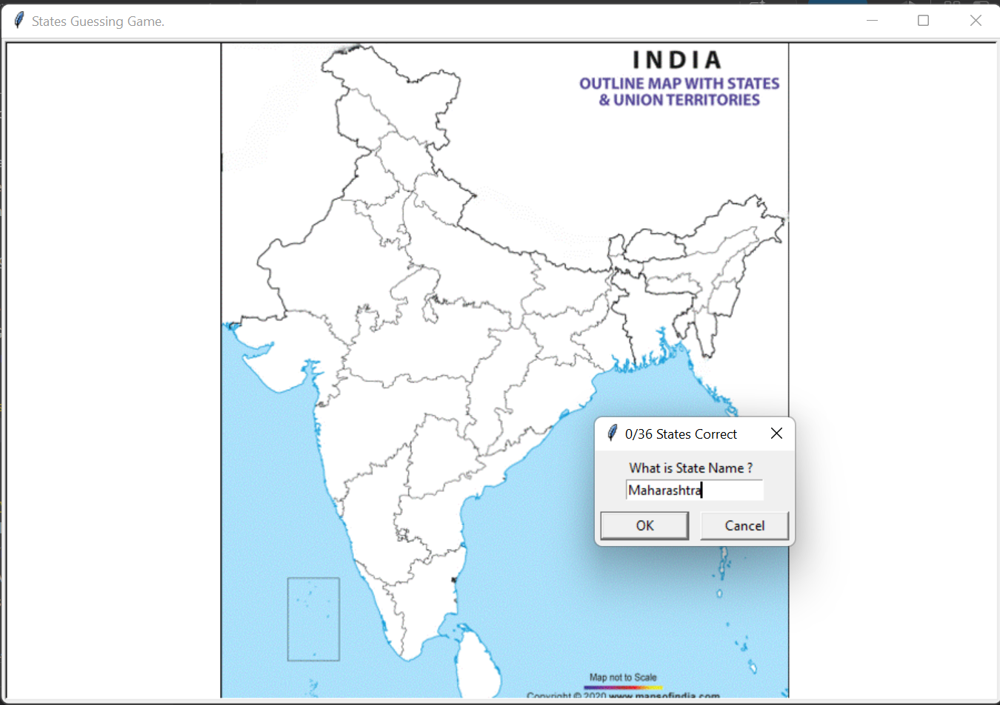
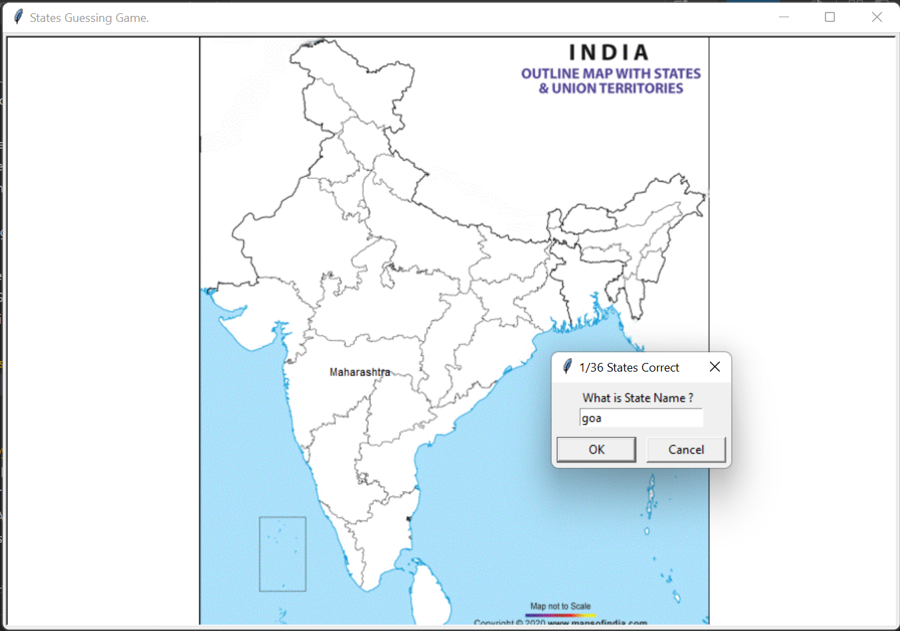

# 🔥 Indian States Guessing Game

A fun and educational **Python Turtle Graphics** game where players guess the names of all **28 Indian States** and **8 Union Territories**. Correct guesses are displayed at their actual locations on the map of India, making geography learning interactive and enjoyable.

      

---

# 📸 Screenshots

### Gameplay



### Gameplay



---

# ✨ Features

* 🇮🇳 Guess all Indian States and Union Territories
* 🗺️ Interactive India map using Turtle Graphics
* 📍 Displays correct guesses at their real locations
* 📊 Tracks the number of correct answers
* ❌ Type **Exit** anytime to quit the game
* 📝 Automatically generates a CSV file containing all missing states
* 📚 Educational and beginner-friendly project
* 🐼 Uses Pandas to read and write CSV files

---

# 📂 Project Structure

```text
17_Indian_States_Game/
│
├── Assets/
│   ├── blank map.gif
│   ├── States name.csv
│   └── Missing States name.csv
│
├── Screenshot/
│   ├── 1.png
│   └── 2.png
│
├── States_Game.py
└── README.md
```

---

# 🛠️ Technologies Used

* Python 3
* Turtle Graphics
* Pandas
* CSV Files

---

# 🚀 How to Run

### Clone the repository

```bash
git clone https://github.com/Harsh-Belekar/Python-Projects.git
```

### Navigate to the project

```bash
cd Python-Projects/17_Indian_States_Game
```

### Install dependencies

```bash
pip install pandas
```

### Run the game

```bash
python States_Game.py
```

---

# 🎮 Gameplay

1. The game displays a blank map of India.
2. Enter the name of any Indian State or Union Territory.
3. If your answer is correct:

   * The name appears at its correct position on the map.
   * Your score increases.
4. Continue until all **36** locations are guessed.
5. Type **Exit** at any time to end the game.
6. The program automatically creates **Missing States name.csv** containing all unguessed locations.

---

# ⚙️ How It Works

* Loads the blank India map using Turtle Graphics.
* Reads all states and their coordinates from **States name.csv**.
* Accepts user guesses through a popup dialog.
* Displays correctly guessed states at their respective coordinates.
* Keeps track of guessed locations.
* Generates a CSV file of remaining states when the user exits.

---

# 📂 Source Files

## `States_Game.py`

Main game logic.

Responsibilities:

* Load India map
* Read state data from CSV
* Accept user input
* Display guessed states
* Track score
* Export missing states

---

# 📁 Assets

## `blank map.gif`

Blank political map of India used as the game background.

---

## `States name.csv`

Contains:

* State / Union Territory names
* X coordinate
* Y coordinate

These coordinates determine where each state's name is displayed.

Example:

```csv
States,x,y
Maharashtra,-124,-45
Goa,-149,-119
Kerala,-107,-212
```

---

## `Missing States name.csv`

Generated automatically when the player exits before completing the game.

Example:

```csv
States
Andhra Pradesh
Punjab
Goa
Kerala
```

This helps players learn the states they missed.

---

# 📚 Concepts Practiced

* Turtle Graphics
* GUI Programming
* Pandas
* CSV File Handling
* Lists
* List Comprehension
* User Input
* Functions
* DataFrames
* Loops
* Conditional Statements
* File Generation

---

# 🎓 Learning Outcomes

Through this project, I learned:

* Building GUI applications with Turtle Graphics
* Reading CSV files using Pandas
* Displaying data based on coordinates
* Working with DataFrames
* Using list comprehensions
* Exporting data to CSV files
* Handling user input in graphical applications
* Creating educational games with Python

---

# 📂 More Projects

This project is part of my **Python Projects Portfolio**, a collection of Python projects covering:

- 🎮 Games
- 🎨 Graphics Programming
- 🖥️ GUI Applications
- 🤖 Automation
- 🌐 API Integrations
- 📊 Data Processing
- 🧩 Python Fundamentals

*Explore the repository to discover more projects and follow my Python learning journey.*

***⭐ If you like this project, don't forget to star the repository!***
