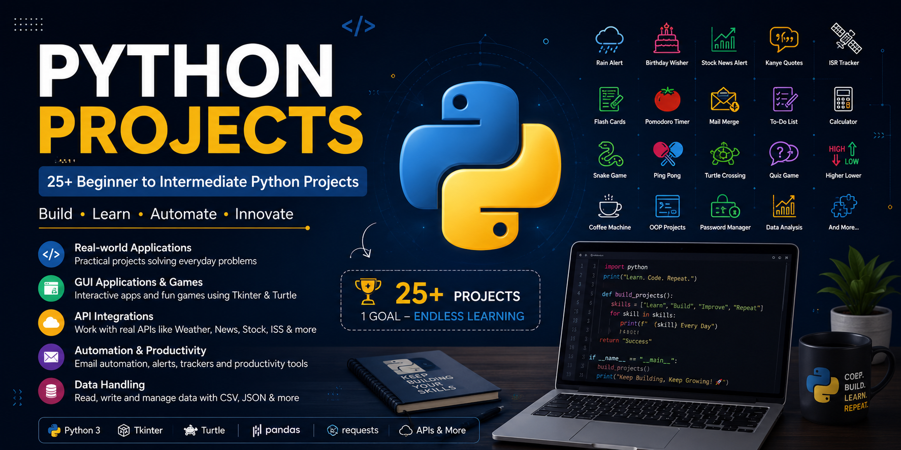

# 🐍 Python Projects Portfolio



A Collection of **Python Projects** built while Learning and Practicing **Python Programming**, **Object-Oriented Programming (OOP)**, **GUI Development**, **APIs**, **Automation**, **File Handling**, and **Game Development**.

This repository showcases my journey from beginner **Python Concepts** to **Real-World Applications** through **Hands-on Projects**.

                

---

## 🌟 Featured Project

After completing these Python projects, I applied my knowledge to build a larger and more advanced game project:

### 🥷 Shinobi Saga

**Shinobi Saga** is a 2D anime-inspired fighting game developed using Python and Pygame.

#### Highlights

- Character movement and combat system
- Shuriken weapon mechanics
- Health bar system
- Menu, Help, Pause, and Game Over screens
- Modular project architecture
- Object-Oriented Programming (OOP)
- Custom game assets and animations

**🔗 Repository:** https://github.com/Harsh-Belekar/Shinobi-Saga

---

## 🚀 Skills Demonstrated

- Python Programming
- Object-Oriented Programming (OOP)
- File Handling
- Exception Handling
- Data Structures & Algorithms
- GUI Development with Tkinter
- Turtle Graphics
- REST API Integration
- JSON Data Processing
- Automation & Scheduling
- Game Development
- Git & GitHub

---

## 📂 Project Collection

### 🎮 Games

| No. | Project              |
| --- | -------------------- |
| 01  | Rock Paper Scissors  |
| 03  | Hangman              |
| 06  | Blackjack            |
| 07  | Number Guessing Game |
| 08  | Higher Lower Game    |
| 10  | Quiz Game            |
| 13  | Snake Game           |
| 14  | Ping Pong Game       |
| 15  | Turtle Crossing Game |

---

### 🛠️ Utilities & Logic Projects

| No. | Project            |
| --- | ------------------ |
| 02  | Password Generator |
| 04  | Caesar Cipher      |
| 05  | Secret Auction     |
| 09  | Coffee Machine     |

---

### 🎨 Turtle Graphics Projects

| No. | Project            |
| --- | ------------------ |
| 11  | The Hirst Painting |
| 12  | Turtle Race        |

---

### 📊 Data Processing Projects

| No. | Project            |
| --- | ------------------ |
| 17  | Indian States Game |
| 18  | NATO Alphabet      |

---

### 🖥️ GUI Applications

| No. | Project            |
| --- | ------------------ |
| 19  | Pomodoro Timer App |
| 20  | Flash Card App     |

---

### 🤖 Automation Projects

| No. | Project         |
| --- | --------------- |
| 16  | Mail Merge      |
| 21  | Birthday Wisher |

---

### 🌐 API-Based Projects

| No. | Project          |
| --- | ---------------- |
| 22  | Rain Alert       |
| 23  | Stock News Alert |
| 24  | Kanye Quotes     |
| 25  | ISR Tracker      |

---

## ⭐ Featured Projects in this Repository

### 🐍 Snake Game

A classic Snake Game built using Python and Turtle Graphics, featuring collision detection, score tracking, and object-oriented design.

### ⏳ Pomodoro Timer App

A productivity application built with Tkinter that helps users manage work and break sessions using the Pomodoro Technique.

### 🧠 Flash Card App

An interactive learning application designed to improve memorization using flashcards and spaced repetition concepts.

### 📊 Stock News Alert

An API-powered application that fetches stock market information and sends relevant news updates.

### 📈 ISR Tracker

A real-world project focused on tracking and displaying live information through API integration and data processing.

---

## 🛠️ Technologies Used

### Programming Language

- Python

### Libraries & Frameworks

- Tkinter
- Turtle Graphics
- Requests
- Pandas
- CSV
- JSON
- SMTP

### Development Tools

- Git
- GitHub
- VS Code

---

## 📁 Repository Structure

```text
Python-Projects/
│
├── README.md
│
├── 01_Rock_Paper_Scissors/
├── 02_Password_Generator/
├── 03_Hangman/
├── 04_Caesar_Cipher/
├── 05_Secret_Auction/
├── 06_Blackjack/
├── 07_Number_Guessing_Game/
├── 08_Higher_Lower_Game/
├── 09_Coffee_Machine/
├── 10_Quiz_Game/
├── 11_Hirst_Painting/
├── 12_Turtle_Race/
├── 13_Snake_Game/
├── 14_Ping_Pong_Game/
├── 15_Turtle_Crossing_Game/
├── 16_Mail_Merge/
├── 17_Indian_States_Game/
├── 18_NATO_Alphabet/
├── 19_Pomodoro_Timer/
├── 20_Flash_Card_App/
├── 21_Birthday_Wisher/
├── 22_Rain_Alert/
├── 23_Stock_News_Alert/
├── 24_Kanye_Quotes/
└── 25_ISR_Tracker/
```

---

## 🎯 Learning Outcomes

Through these projects, I gained practical experience in:

- Writing clean and maintainable Python code
- Applying Object-Oriented Programming principles
- Building desktop GUI applications
- Working with APIs and external services
- Automating real-world tasks
- Managing files and datasets
- Creating interactive games
- Implementing event-driven programming
- Structuring multi-file Python projects
- Using Git and GitHub for version control

---

## 📚 Learning Journey

My Python learning path evolved through several stages:

### 1️⃣ Python Fundamentals

- Variables
- Data Types
- Loops
- Functions
- Conditionals

### 2️⃣ Intermediate Python

- File Handling
- Error Handling
- Modules
- OOP Concepts

### 3️⃣ GUI Development

- Tkinter Applications
- User Interaction
- Event Handling

### 4️⃣ Automation & APIs

- HTTP Requests
- JSON Processing
- Email Automation
- Real-Time Data Integration

### 5️⃣ Game Development

- Turtle Graphics
- Collision Detection
- Game Loops
- Object-Oriented Design

### 6️⃣ Large-Scale Project Development

- Shinobi Saga (Python + Pygame)
- Modular Architecture
- Multi-file Project Structure
- Asset Management
- Software Design Principles

---

## 🚀 What's Next?

I'm currently expanding my software development and AI journey through larger projects such as:

- 🥷 Shinobi Saga (Python + Pygame Fighting Game)
- 🤖 Autonomous Drone Project (C++ + Raspberry Pi)
- 🎭 Face Recognition Attendance System
- 📊 Data Analytics Projects
- 🧠 Artificial Intelligence & Machine Learning Projects

---

## 🧑‍💻 Author

**👤 Harsh Belekar**  
📍 Data Analyst | Python Developer | SQL | Power BI | Excel | Data Visualization  
📬 [LinkedIn](https://www.linkedin.com/in/harshbelekar) | 🔗[GitHub](https://github.com/Harsh-Belekar)

📧 [harshbelekar74@gmail.com](mailto:harshbelekar74@gmail.com)

---

*⭐ If you find these projects interesting, consider giving this repository a star and exploring the individual project folders for more details.*
